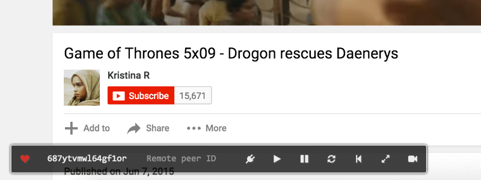

# coplay

Synchronizing video play between two peers.

## Intro

When two browsers are playing the same web video, coplay can connect them with WebRTC (using PeerJS) and enable users to control two video players synchronously.

Coplay now works on Youku, Sohu TV, Tencent Video, Tudou, iQiyi, YouTube and bilibili.

## Installation

*Not published on Firefox Add-ons yet.*

Download URL: https://github.com/Justineo/coplay/zipball/gh-pages

### Chrome

Visit [coplay on Chrome Web Store](https://chrome.google.com/webstore/detail/coplay/heolgpojkkeacaokbpolhalhlaidpkkc/) and install the extension.

### Firefox

Drag `extensions/packed/coplay.xpi` into Firefox to install.

## Usage

Both browsers visit a same video page, activate coplay and one of the users enter the other one's peer ID and connect.

After establishing the connection, both users can perform pause/resume/seek/restart/sync actions.

## FAQ

* Why Peer ID doesn't show up on Youtube?

  Youtube uses HTTPS but PeerJS (the WebRTC service which coplay rely on) will make some HTTP requests, which are blocked by browsers' security policies. Current work around see [here](http://du.screenstepslive.com/s/docs/m/7107/l/219447-allow-mixed-content-in-browsers).

## One More Thing

We need an appropriate **icon** for coplay!
